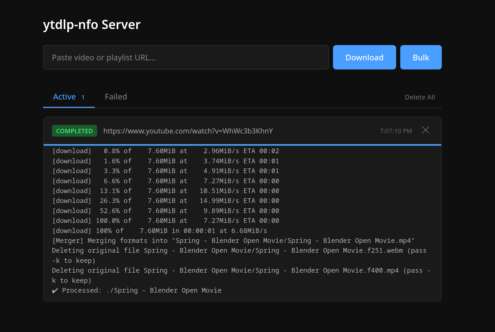

<!-- VERSION: LNA-DEV-README-TEMPLATE V1.3 -->

[![Contributors][contributors-shield]][contributors-url]
[![Forks][forks-shield]][forks-url]
[![Stargazers][stars-shield]][stars-url]
[![Issues][issues-shield]][issues-url]
[![MIT License][license-shield]][license-url]

<!-- PROJECT LOGO -->
<br />
<div align="center">
  <a href="https://github.com/lna-dev/ytdlp-nfo-server">
    
  </a>

### ytdlp-nfo-server

A web server wrapping [ytdlp-nfo](https://github.com/lna-dev/ytdlp-nfo) with a queue-based job system, real-time progress streaming, and a built-in web UI.

<p align="center">

<br />

<a href="https://github.com/lna-dev/ytdlp-nfo-server"><strong>Explore the Project »</strong></a>
<br />
<br />
<a href="https://github.com/lna-dev/ytdlp-nfo-server/issues">Report Bug</a>
·
<a href="https://github.com/lna-dev/ytdlp-nfo-server/issues">Request Feature</a>
  </p>
</div>



## Features

- Web UI for submitting and monitoring downloads
- Bulk import of up to 500 URLs at once
- Configurable concurrent downloads with FIFO queue
- Real-time progress streaming via Server-Sent Events
- Automatic retries with exponential backoff
- Job state persistence across restarts
- Duplicate URL detection

## Usage

### Docker Compose

```yaml
services:
  ytdlp-nfo-server:
    image: ghcr.io/lna-dev/ytdlp-nfo-server:latest
    ports:
      - 8080:8080
    volumes:
      - ./download:/downloads
      - ./data:/data
    environment:
      - MAX_CONCURRENT=3
      - MAX_RETRIES=3
    restart: unless-stopped
```

```bash
docker compose up -d
```

### Environment Variables

| Variable | Default | Description |
|---|---|---|
| `PORT` | `8080` | Server port |
| `DOWNLOAD_DIR` | `./downloads` | Download destination |
| `DATA_DIR` | | Job state persistence directory |
| `MAX_CONCURRENT` | `3` | Max parallel downloads |
| `MAX_RETRIES` | `3` | Max retry attempts per job |
| `YTDLP_CHANNEL` | `stable` | yt-dlp version channel (`stable`, `master`, `nightly`) |

## License

MIT

<!-- MARKDOWN LINKS & IMAGES -->
[contributors-shield]: https://img.shields.io/github/contributors/lna-dev/ytdlp-nfo-server.svg?style=for-the-badge
[contributors-url]: https://github.com/lna-dev/ytdlp-nfo-server/graphs/contributors
[forks-shield]: https://img.shields.io/github/forks/lna-dev/ytdlp-nfo-server.svg?style=for-the-badge
[forks-url]: https://github.com/lna-dev/ytdlp-nfo-server/network/members
[stars-shield]: https://img.shields.io/github/stars/lna-dev/ytdlp-nfo-server.svg?style=for-the-badge
[stars-url]: https://github.com/lna-dev/ytdlp-nfo-server/stargazers
[issues-shield]: https://img.shields.io/github/issues/lna-dev/ytdlp-nfo-server.svg?style=for-the-badge
[issues-url]: https://github.com/lna-dev/ytdlp-nfo-server/issues
[license-shield]: https://img.shields.io/github/license/lna-dev/ytdlp-nfo-server.svg?style=for-the-badge
[license-url]: https://github.com/lna-dev/ytdlp-nfo-server/blob/master/LICENSE
